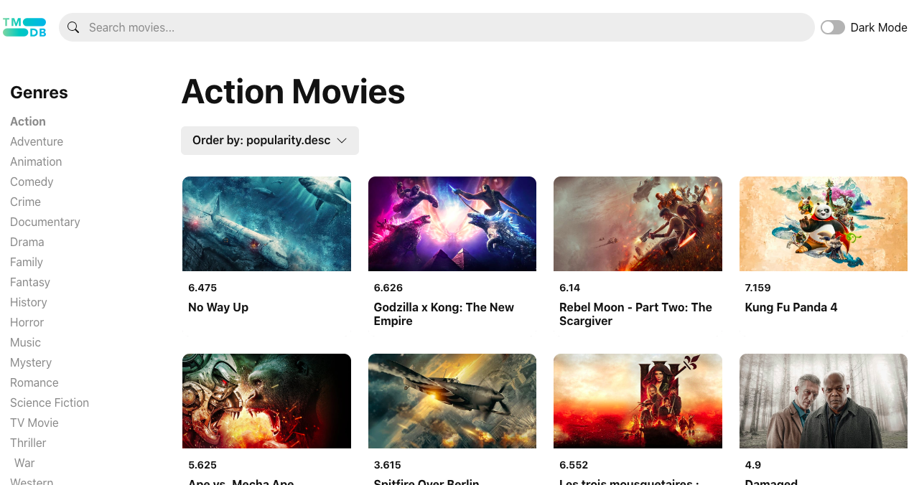
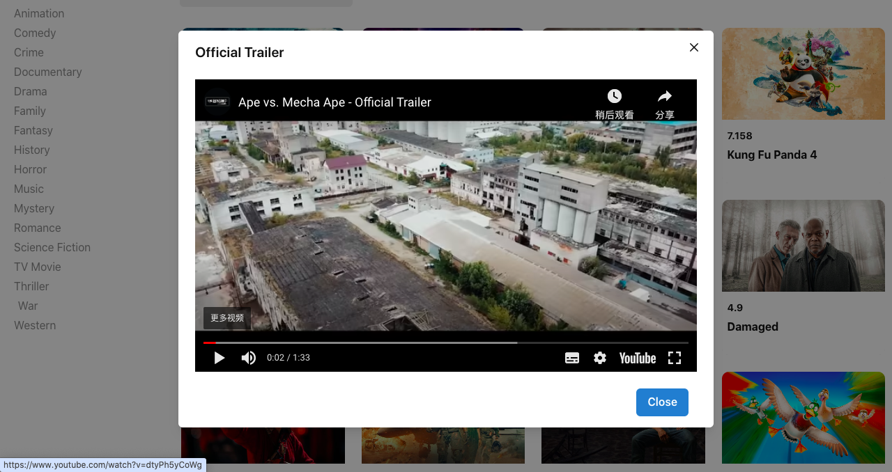

  

  <h3 align="center">Movie Hub</h3>

  

    <a href="https://movie-hub-wine.vercel.app/">View Demo</a>
    ·
    <a href="https://github.com/Molly6943/Movie-hub/issues">Report Bug</a>
    ·
    <a href="https://github.com/Molly6943/Movie-hub/pulls">Request Feature</a>
  

  
Table of Contents

  <ol>
    <li>
      <a href="#prerequests">Prerequests</a>
    </li>
    <li>
      <a href="#which-features-this-project-deals-with">Which features this project deals with</a>
    </li>
    <li><a href="#third-party-libraries-used-except-for-react-and-rtk">Third Party libraries used except for React and RTK</a></li>
    <li>
      <a href="#contact">Contact</a>
    </li>
  </ol>

 

  
  
Home Page

  
  
Watch Page

## Prerequests

- Create an account if you don't have on [TMDB](https://www.themoviedb.org/).
  Because I use its free API to consume movie/tv data.
- And then follow the [documentation](https://developers.themoviedb.org/3/getting-started/introduction) to create API Key
- Finally, if you use v3 of TMDB API, create a file named `.env`, and copy and paste the content of `.env.example`.
  And then paste the API Key you just created.

## Third Party libraries used

- [react-router-dom@v6.9](https://reactrouter.com/en/main)
- [Chakra UI](https://v2.chakra-ui.com/)
- [Redux Toolkit](https://www.npmjs.com/package/@reduxjs/toolkit)
- [React Youtube](https://www.npmjs.com/package/react-youtube)

## Todo

- Demonstrates basic usage of the TMDB API.
- Demonstrates basic usage of the `React`, `Router`, `Redux-toolkit`, `context`, `Custom hooks`.
- Browse the most popular movies.
- Watch the trailer for the movie。
- Responsive UI experience。